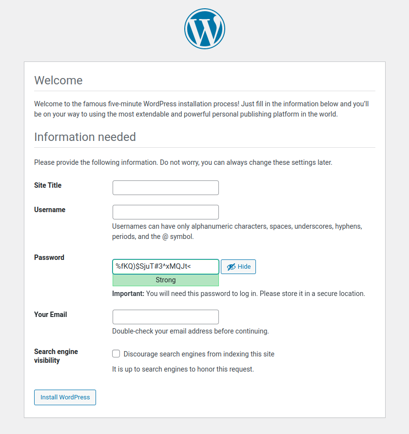

# Install Wordpress on FreeBSD with ansible

Requirements on target server:

- Enable ssh
- Install latest python

Usage:

- Copy inventory-example.yml to inventory.yml and edit based on your needs.
- Copy secrets.yml to secrets.yml at group_vars/bsd_hosts folder and edit based on your needs.
- Run the playbook specifying the inventory file: `ansible-playbook -i inventory.yml install_wordpress.yml`

Result:

_NO need to input database details. Just edit your site title, username, password, email, and you rock!!!_
